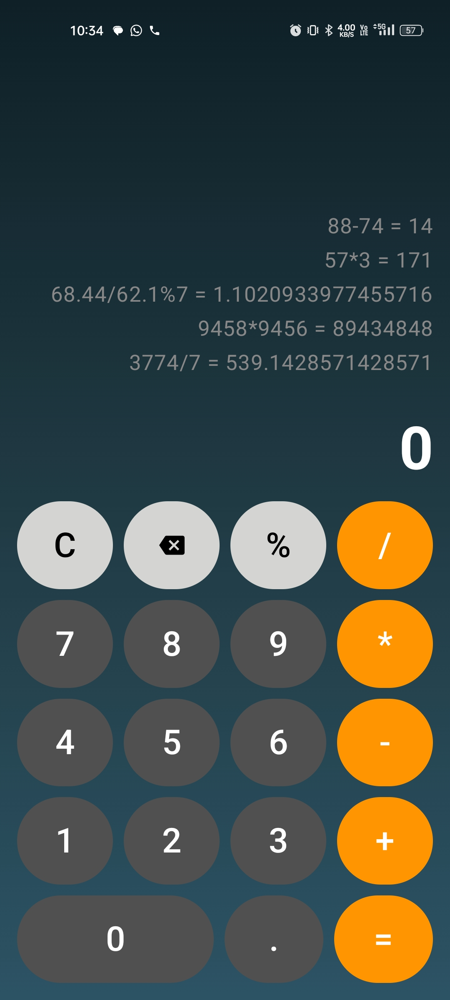
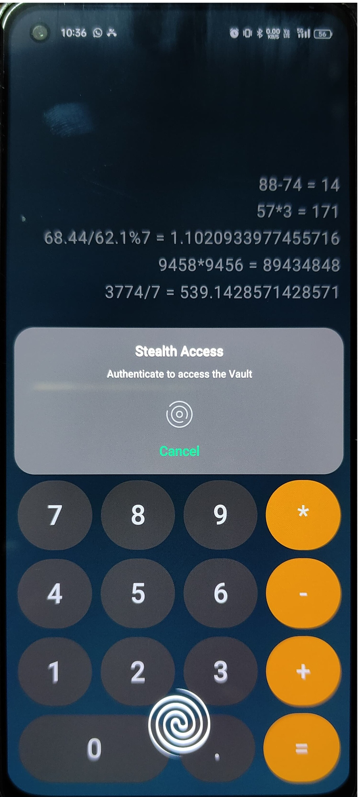
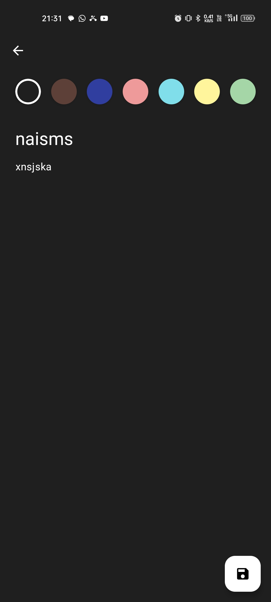
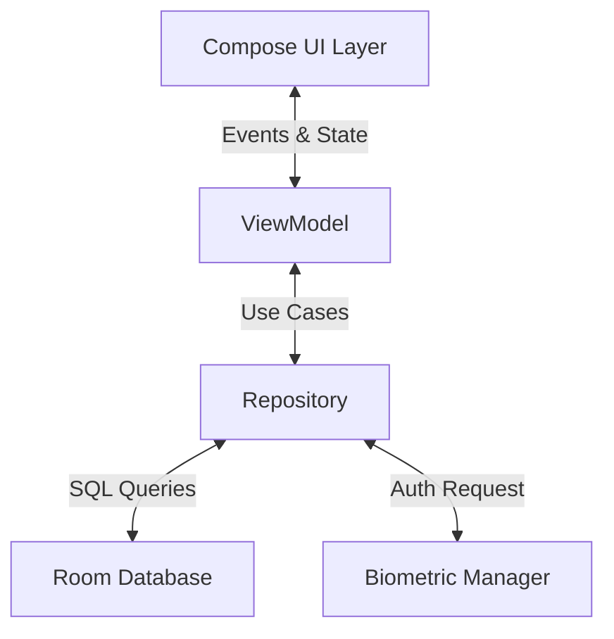

<div align="center">

# 🔐 StealthCalc
### The Calculator That Keeps Secrets.


<br />

<a href="https://github.com/SilentFURY-x/StealthCalc-Secret-Notes-Calculator-App/releases/download/v1.0.0/StealthCalc-v1.0.0.apk">
  
</a>

<br /> <br />

<p align="center">
  <a href="#-key-features">Features</a> •
  <a href="#-screenshots">Screenshots</a> •
  <a href="#tech-stack">Tech Stack</a> •
  <a href="#architecture">Architecture</a> •
  <a href="#-getting-started">Setup</a>
</p>

</div>

---

## 🕵️ About The Project

**StealthCalc** appears to be a beautifully designed, functional calculator. But beneath the surface lies a secure, encrypted vault for your private notes.

Engineered with **Modern Android Development (MAD)** standards, this app demonstrates how to blend utility with security. It features a cyberpunk-inspired aesthetic, fluid **Edge-to-Edge** transitions, and industry-standard biometric authentication.

> **"Hidden in plain sight."** — A privacy tool that doesn't look like one.

---

## 🚀 Key Features

### 🎭 The Disguise (Calculator Mode)
* **Fully Functional Engine:** Powered by `exp4j` for complex arithmetic (`+`, `-`, `*`, `/`, `%`).
* **Smart History:** A scrollable tape logs your calculations in real-time.
* **Immersive UI:** A stunning "Cyberpunk" gradient interface that draws behind system bars.

### 🔐 The Vault (Secret Mode)
* **The Trigger:** Enter the access code **`69/67`** and press **`=`** to initiate the unlock sequence.
* **Biometric Gate:** Hardware-backed **Fingerprint / Face ID** authentication prevents unauthorized access.
* **Persistent Storage:** Notes are securely stored using a local **Room Database**.

### ✨ The Experience (UX)
* **Masonry Grid:** Notes are displayed in a staggered, dynamic grid (similar to Google Keep).
* **Gesture Control:** Swipe-to-delete notes with haptic feedback and undo animations.
* **Adaptive Contrast:** The note editor automatically adjusts text color (Black/White) based on the background luminance for perfect readability.
* **Fluid Navigation:** Custom entry/exit animations make the vault feel like a physical hidden layer.

---

## 📸 Screenshots

<div align="center">

| **The Disguise** | **The Unlock** | **The Vault** | **The Editor** |
|:---:|:---:|:---:|:---:|
|  |  |  |  |

</div>

---

<a id="tech-stack"></a>
## 🛠️ Tech Stack

Built entirely with Kotlin and the latest Jetpack libraries.

| Layer | Component | Technology Used |
| :--- | :--- | :--- |
| **🎨 UI** | **Design System** | Jetpack Compose (Material 3) |
| | **Animations** | Compose Animation API (Shared Transitions) |
| | **Immersion** | Edge-to-Edge API |
| **🧠 Logic** | **Architecture** | MVVM + Clean Architecture principles |
| | **DI** | Dagger Hilt |
| | **Concurrency** | Coroutines & Kotlin Flows |
| **💾 Data** | **Local DB** | Room (SQLite Abstraction) |
| | **Math Engine** | exp4j |
| **🛡️ Security** | **Auth** | Android Biometric API |

---

<a id="architecture"></a>
## 🏗️ Architecture

StealthCalc follows a strict **Unidirectional Data Flow (UDF)** and separation of concerns.


---

## Directory Structure

```text
com.fury.stealthcalc
├── data             # Room Entities, DAOs, and Database config
├── di               # Hilt Dependency Injection Modules
├── presentation     # UI Layer
│   ├── calculator   # Calculator Logic & State
│   ├── vault        # Staggered Grid & Gestures
│   └── add_edit     # Adaptive Color Logic
├── ui.theme         # Custom Typography & Color Systems
└── domain           # (Optional) Business Logic & Use Cases
```
---

## ⚡ Getting Started

>**NOTE: — Biometric must be enabled on your device.**

**Download the App:**
* Click below to download the latest stable version (v1.0.0) for your Android device:
* 👉 **[Download StealthCalc-v1.0.0.apk](https://github.com/SilentFURY-x/StealthCalc-Secret-Notes-Calculator-App/releases/download/v1.0.0/StealthCalc-v1.0.0.apk)**
    
**OR**
* To explore the code or build it yourself:

  1. Clone the repository
  
    ```bash
    
    git clone https://github.com/SilentFURY-x/StealthCalc-Secret-Notes-Calculator-App.git
    
    ```
    
  2. Open in Android Studio
    
    * Ensure you are using Android Studio Koala or newer.
    * Minimum SDK: API 26 (Android 8.0).
  
  3. Build & Run
    
    * Sync Gradle.
    * Select app configuration.
    * Run on an Emulator (with Fingerprint enabled) or Physical Device.

---

## 🤝 Contributing

Contributions are what make the open-source community such an amazing place to learn, inspire, and create. Any contributions you make are **greatly appreciated**.
1.  Fork the Project
2.  Create your Feature Branch:
    ```bash
    git checkout -b feature/AmazingFeature
    ```
3.  Commit your Changes:
    ```bash
    git commit -m 'Add some AmazingFeature'
    ```
4.  Push to the Branch:
    ```bash
    git push origin feature/AmazingFeature
    ```
5.  Open a Pull Request

---

## 👨‍💻 Author
<div align="center">

**Arjun Tyagi**

[](https://github.com/SilentFURY-x)
[](https://www.linkedin.com/in/arjun-tyagi-84b1b5328/)

</div>

<br />

<p align="center"> "🔐<i> Real security is not just about strong locks, but about not knowing there is a door at all."</i> </p>
